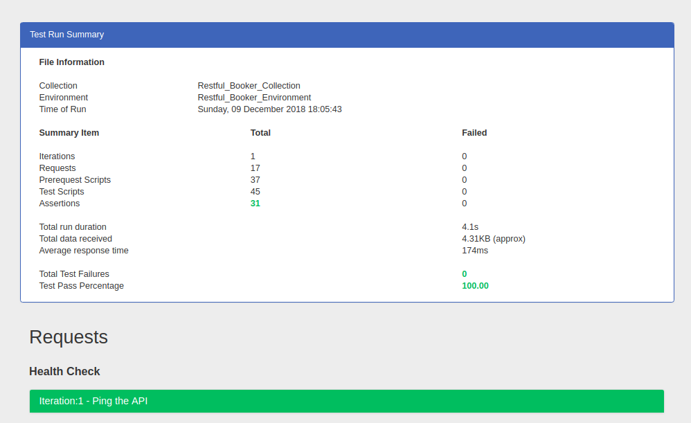
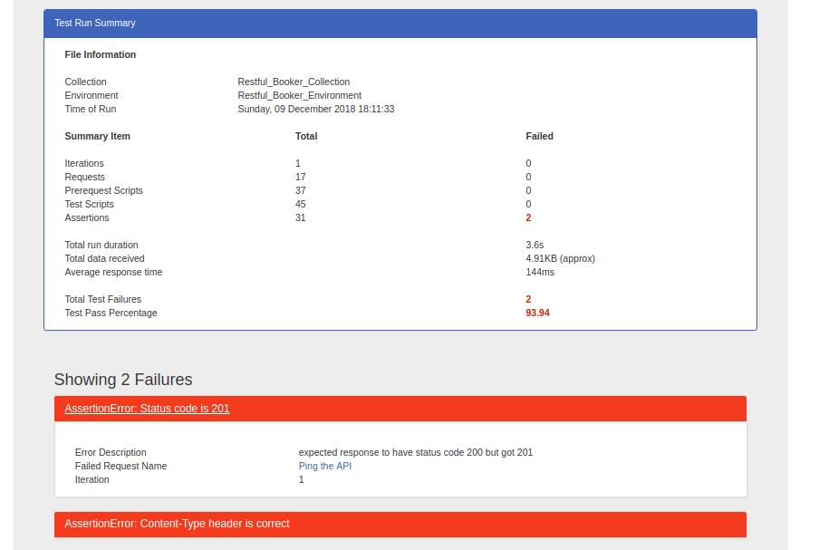
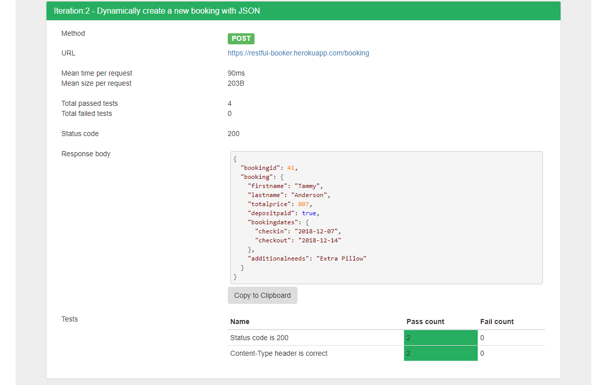

# newman-reporter-htmlextra

[](https://www.npmjs.com/package/newman-reporter-htmlextra)
[](https://www.npmjs.com/package/newman-reporter-htmlextra)


A newman HTML reporter that has been extended to include the separation of the iteration runs so these are no longer aggregated together and also some additional helpers to expose items like `Test Pass Percentage`. Also created a default template that can be used to show the different changes.

---

This work have been hugely inspired and copied several aspects of the great work done by [Martijn Vander Vlag](https://github.com/martijnvandervlag) to create the [newman-reporter-htmlfull](https://github.com/martijnvandervlag/newman-reporter-htmlfull) package. Check out that package too, this contains many of the same features.

### Some of the Extras

- Full test runs and not aggregated stats - Default template shows iteration number in heading
- Includes the full [handlebars-helpers](https://www.npmjs.com/package/handlebars-helpers) module for building better templates
- New `percent` helper to help exposing data like `Test Pass Percentage` - e.g `{{percent assertions.total assertions.failed}}`
- Copy and Paste any of the Response Bodies
- Includes an `inc` helper to work with thing like the handlebars zero index - e.g `Iteration:{{inc cursor.iteration}} - {{item.name}}`
- Added the [helper-moment](https://github.com/helpers/helper-moment) module so you have more control over the display dates - e.g `{{moment date format="dddd, DD MMMM YYYY HH:mm:ss"}}`
- More to come...

### Example Reports







## Install
> The installation should be global if newman is installed globally, local otherwise. (Replace -g from the command below with -S for a local installation)

```console
$ npm install -g newman-reporter-htmlextra
```

## Usage
In order to enable this reporter, specify `htmlextra` in Newman's `-r` or `--reporters` option.

```console
$ newman run https://www.getpostman.com/collections/631643-f695cab7-6878-eb55-7943-ad88e1ccfd65-JsLv -r htmlextra
```

### Options

#### With Newman CLI

| CLI Option  | Description       |
|-------------|-------------------|
| `--reporter-htmlextra-export <path>` | Specify a path where the output HTML file will be written to disk. If not specified, the file will be written to `newman/` in the current working directory. |
| `--reporter-htmlextra-template <path>` | Specify a path to the custom template which will be used to render the HTML report. This option depends on `--reporter htmlextra` and `--reporter-htmlextra-export` being present in the run command. If this option is not specified, the [default template](./lib/template-default.hbs) is used |

Custom templates (currently handlebars only) can be passed to the HTML reporter via `--reporter-htmlextra-template <path>` with `--reporters htmlextra` and `--reporter-html-export`.
The [default template](./lib/template-default.hbs) is used in all other cases.

#### With Newman as a Library
The CLI functionality is available for programmatic use as well.

```javascript
const newman = require('newman');

newman.run({
    collection: require('./examples/Restful_Booker_Collection.json'), // can also provide a URL or path to a local JSON file.
    environment: require('./examples/Restful_Booker_Environment.json'),
    reporters: 'htmlextra',
    reporter: {
        htmlextra: {
            export: './htmlResults.html', // If not specified, the file will be written to `newman/` in the current working directory.
            template: './lib/template-default.hbs' // optional, this will be picked up relative to the directory that Newman runs in.
        }
    }
}, function (err) {
	if (err) { throw err; }
    console.log('collection run complete!');
});
```

## Compatibility

| **newman-reporter-htmlextra** | **newman** | **node** |
|:------------------------:|:----------:|:--------:|
|          v1.0.0          | >= v4.0.0  | >= v6.x  |

## Community Support


If you are interested in talking to the Postman team and fellow Newman users, you can find us on our <a href="https://community.getpostman.com">Postman Community Forum</a>. Feel free to drop by and say hello. You'll find us posting about upcoming features and beta releases, answering technical support questions, and contemplating world peace.

Sign in using your Postman account to participate in the discussions and don't forget to take advantage of the <a href="https://community.getpostman.com/search?q=newman">search bar</a> - the answer to your question might already be waiting for you! Don’t want to log in? Then lurk on the sidelines and absorb all the knowledge.


## License
This software is licensed under Apache-2.0. Copyright Postdot Technologies, Inc. See the [LICENSE.md](LICENSE.md) file for more information.
